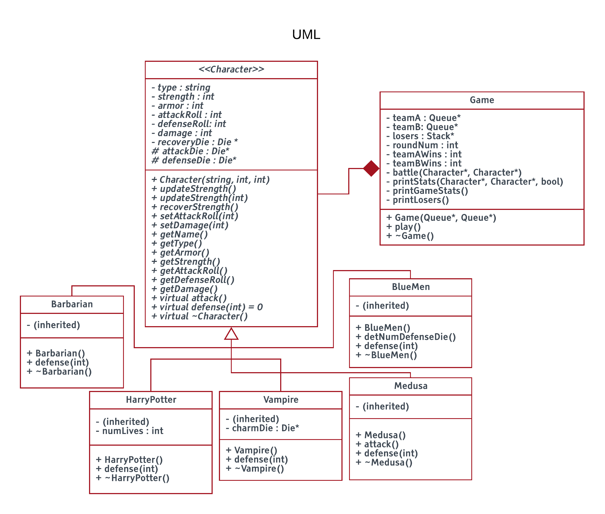

# Fantasy Combat Tournament

Run a fantasy combat tournament between two teams based on the players/characters selected. One user sets up the two teams. The players battle in the order they are chosen for each team. If they win, they go to the end of the lineup (queue DS) and a percentage of their health is restored; otherwise, they get pushed onto the top of the losers' bracket (stack DS). The tournament finishes when one of the team does not have any more fighters to fight. As the tournament is played, it prints out the result of each battle, and at the end, the overall tournmanet. The user has the choice to see the losers. 



| Type			| Attack		| Defense		| Armor			| Strength Points 	| Special Ability 	|
| ------------- | ------------- | ------------- | ------------- | ----------------- | ----------------- |
| Vampire		| 1 12-sided die| 1 6-sided die | 1				| 18				| Can charm an opponent into not attacking. For a given attack, there is a 50% chance that their opponent does not actually attack them. |
| Barbarian		| 2 6-sided die	| 2 6-sided die | 0				| 12				| N/A  				|
| Blue Men		| 2 10-sided die| 3 6-sided die | 3				| 12				| Actually a swarm of small individuals. For every 4 points of damage, they lose one defense die. |
| Medusa		| 2 6-sided die | 1 6-sided die | 3				| 8					| Rolling a 12 with their attack die, the opponent instantly gets turned into stone and Medusa wins!  |
| Harry Potter	| 2 6-sided die | 2 6-sided die | 0				| 10 or 20			| Immediately recovers and his total strength becomes 20 after first loss. If he were to loses again, then he's out for good.  |

## Getting Started

These instructions will get you a local copy of the project up and running on your machine.

### Installing
```sh
git clone https://github.com/code-tsunami/fantasycombat
```

### Usage

**Compile/build**:
```
cd fantasycombat
make
```

**Run**:
```sh
smallsh
```

## Author

* **Sonam Kindy** - [code-tsunami](https://github.com/code-tsunami)

## License

This project is licensed under the MIT License - see the [LICENSE](LICENSE) file for details.
